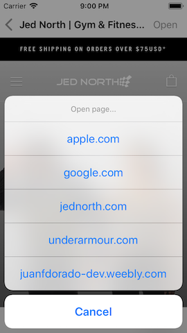

# Easy Browser

## Description
Embed WebKit and learn about delegation, KVO, classes and UIToolbar

## Demo
### features/create-simple-browser-with-wkwebview
| Screenshot 01 |
| ------------- |
|  |

### features/choosing-a-website
| Screenshot 02 | Screenshot 03 | Screenshot 04 |
| ------------- | ------------- | ------------- |
|  |  |  |

### features/monitor-page-loads
| Screenshot 05 | Screenshot 06 |
| ------------- | ------------- |
|  |  |

### features/refactoring
| Screenshot 07 | Screenshot 08 |
| ------------- | ------------- |
|  |  |

### features/external-file-for-websites
| Screenshot 09 | Screenshot 10 | Screenshot 11 |
| ------------- | ------------- | ------------- |
|  |  |  |